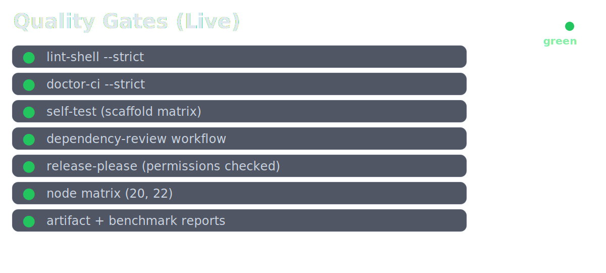

<p align="center">
  
</p>

<h1 align="center">dev-toolbox</h1>

<p align="center">A practical maintainer toolkit for scaffolding and running repositories like real products.</p>

<p align="center">
  <a href="https://github.com/PetriLahdelma/dev-toolbox/actions/workflows/ci.yml"></a>
  <a href="https://github.com/PetriLahdelma/dev-toolbox/actions/workflows/release.yml"></a>
  <a href="https://github.com/PetriLahdelma/dev-toolbox/actions/workflows/dependency-review.yml"></a>
  <a href="./LICENSE"></a>
</p>

<p align="center">
  <a href="#quickstart">Quickstart</a> ·
  <a href="#proof--demos">Proof & Demos</a> ·
  <a href="#profiles">Profiles</a> ·
  <a href="#commands">Commands</a>
</p>

## Why this exists

- New repos should start with real defaults, not TODO checklists.
- Repository hygiene should be repeatable and script-first.
- Scaffold output should be deployable, testable, and maintainable on day one.

## Proof & demos

### Animated scaffold run



### Quality gates



### Real scaffold output screenshots (`next-app --all-next-extras`)

<p>
  
  
  
</p>

```bash
./scripts/scaffold demo-next next-app /tmp/devtoolbox-visual-demo --all-next-extras --owner @PetriLahdelma --force
```

## Quickstart

```bash
# 1) Validate local toolchain
./scripts/doctor

# 2) Validate this repo baseline (strict)
./scripts/doctor-ci . --strict

# 3) Run end-to-end toolbox checks
./scripts/self-test

# 4) Scaffold a production-ready project
./scripts/scaffold my-app next-app . --owner @PetriLahdelma --all-next-extras

# 5) Validate the scaffolded project
./scripts/doctor-ci ./my-app --strict
```

## Profiles

| Profile | Best for | Output highlights |
| --- | --- | --- |
| `node-cli` | npm libraries and CLIs | Strict CI gates, release workflow, maintainer docs |
| `next-app` | Next.js products | Tailwind + shadcn-style UI + Radix + Vercel defaults + optional Storybook |
| `github-action` | Composite actions | Action starter with shell-focused CI and baseline docs |

`next-app` extras:

- `--motion`
- `--remotion`
- `--vercel-agents` (alias: `--vercel-agent-brovers`)
- `--storybook` (Storybook + a11y/docs/links/themes/onboarding addons)
- `--claude` / `--claude-code`
- `--all-next-extras`

## Project standards included

Every scaffolded project gets a baseline from `templates/baseline/`:

- `CODEOWNERS`
- `CONTRIBUTING.md`
- `SECURITY.md`
- issue/PR templates
- Dependabot config
- CI + release workflows with explicit permissions
- dependency review workflow

## Commands

| Command | Purpose |
| --- | --- |
| `scripts/doctor` | Validate required and optional local tooling |
| `scripts/lint-shell` | Run shellcheck against scripts/templates |
| `scripts/doctor-ci` | Check repository baseline quality and output report |
| `scripts/self-test` | Execute scaffold/profile/benchmark validation matrix |
| `scripts/smoke` | Run `lint`, `typecheck`, `test`, `build` if present |
| `scripts/changelog` | Build/apply changelog sections from commit history |
| `scripts/bench` | Benchmark commands and export report artifacts |
| `scripts/release` | Guarded release dry-run and optional apply flow |
| `scripts/profile-show` | Inspect a profile definition |
| `scripts/profile-apply` | Apply profile templates/workflows to an existing repo |
| `scripts/scaffold` | Create a new repo from profile template + baseline |
| `scripts/image-opt` | Optimize image assets with local tools |
| `scripts/log-scan` | Extract high-signal errors from log files |

`justfile` and `Makefile` wrappers are included for teams that prefer command runners.

## Docs

- `docs/getting-started.md`
- `docs/profiles.md`
- `docs/scaffold.md`
- `docs/release-setup.md`

## Local rituals

- Run `scripts/smoke` before pushing.
- Keep PRs focused and small.
- Prefer deterministic scripts over manual release steps.

## License

MIT. See `LICENSE`.
